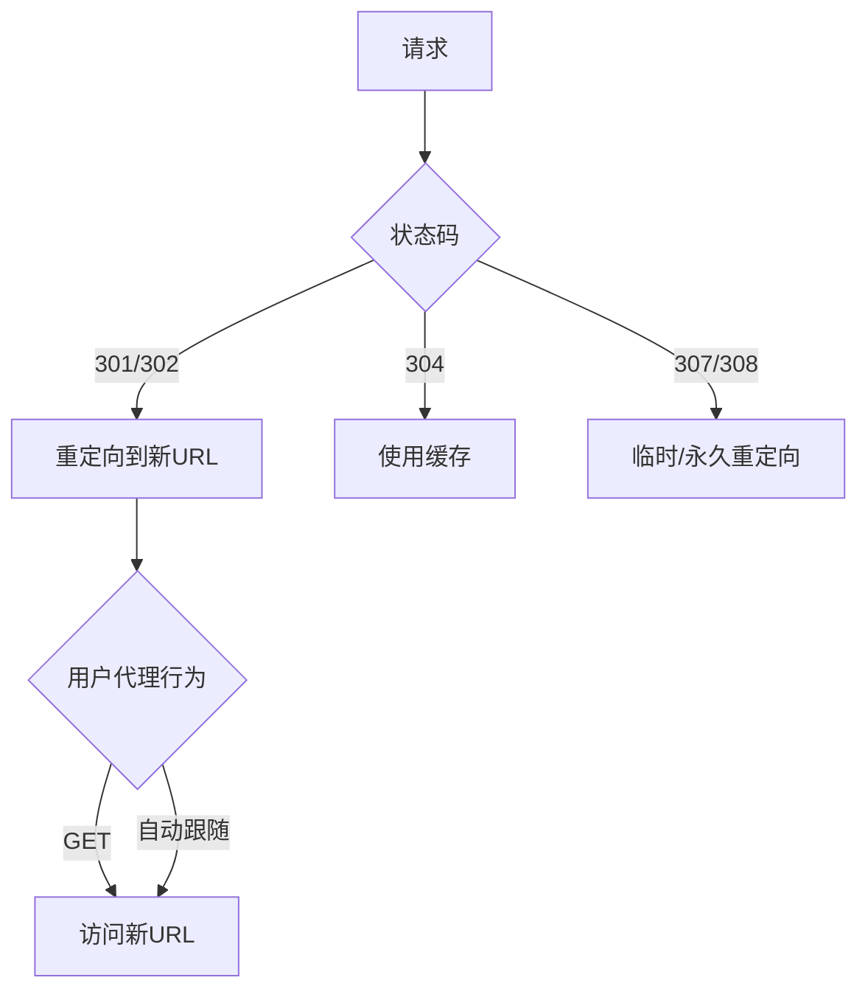

# HTTP 协议完全指南

## 目录
1. [HTTP 简介](#1-http-简介)
2. [HTTP 工作原理](#2-http-工作原理)
3. [HTTP 请求与响应](#3-http-请求与响应)
4. [HTTP 方法详解](#4-http-方法详解)
5. [HTTP 状态码](#5-http-状态码)
6. [HTTP 头字段](#6-http-头字段)
7. [HTTP 缓存机制](#7-http-缓存机制)
8. [HTTPS 与安全](#8-https-与安全)
9. [HTTP 版本演进](#9-http-版本演进)
10. [实际应用示例](#10-实际应用示例)

---

## 1. HTTP 简介

### 什么是 HTTP

HTTP（HyperText Transfer Protocol，超文本传输协议）是用于分布式、协作式、超媒体信息系统的应用层协议。它是万维网（World Wide Web，简称WWW）数据通信的基础，于1990年由蒂姆·伯纳斯-李（Tim Berners-Lee）首次提出。

HTTP 协议的主要特点：

| 特点 | 说明 |
|------|------|
| **无状态** | 服务器不保留之前请求的信息，每个请求都是独立的 |
| **无连接** | 早期版本每请求一次建立一次连接，现已改进为支持持久连接 |
| **明文传输** | 早期版本数据明文传输，HTTPS 通过加密保障安全 |
| **请求-响应模型** | 客户端发起请求，服务器返回响应 |
| **灵活可扩展** | 支持多种数据类型（HTML、图片、视频等） |

### HTTP 与 HTTPS 的区别

| 对比项 | HTTP | HTTPS |
|--------|------|-------|
| 端口 | 80 | 443 |
| 传输方式 | 明文 | 加密（SSL/TLS） |
| 安全性 | 低 | 高 |
| 证书 | 无需 | 需要 CA 证书 |
| 性能 | 略高 | 略低（因加密开销） |
| SEO 优化 | - | Google 优先收录 |

---

## 2. HTTP 工作原理

### 请求-响应模型

HTTP 采用经典的客户端-服务器架构，工作流程如下：

```
┌─────────┐          请求           ┌─────────┐
│         │ ───────────────────────→ │         │
│  客户端  │                          │  服务器  │
│         │ ←─────────────────────── │         │
└─────────┘          响应           └─────────┘
```

### 详细工作步骤

1. **建立 TCP 连接**
   - 客户端与服务器通过 TCP 三次握手建立连接
   - HTTP/1.1 默认使用持久连接（keep-alive）

2. **发送 HTTP 请求**
   - 客户端构造请求消息（请求行、请求头、请求体）
   - 通过已建立的连接发送

3. **服务器处理请求**
   - 服务器解析请求消息
   - 定位请求资源
   - 执行相应逻辑

4. **返回 HTTP 响应**
   - 服务器构造响应消息（状态行、响应头、响应体）
   - 通过连接返回给客户端

5. **关闭连接**
   - HTTP/1.1 默认保持连接，等待后续请求
   - 可通过 `Connection: close` 主动关闭

### HTTP 消息结构

**请求消息格式：**

```http
GET /index.html HTTP/1.1
Host: www.example.com
User-Agent: Mozilla/5.0 (Windows NT 10.0; Win64; x64)
Accept: text/html,application/xhtml+xml
Accept-Language: zh-CN,zh;q=0.9
Accept-Encoding: gzip, deflate
Connection: keep-alive

（请求体，可选）
```

**响应消息格式：**

```http
HTTP/1.1 200 OK
Server: nginx/1.20.1
Content-Type: text/html; charset=utf-8
Content-Length: 1234
Cache-Control: max-age=3600
Date: Wed, 08 Apr 2026 12:00:00 GMT

（响应体）
<!DOCTYPE html>
<html>
<head><title>Example</title></head>
<body>...</body>
</html>
```

---

## 3. HTTP 请求与响应

### 请求方法

HTTP 定义了多种请求方法，常见的有：

| 方法 | 描述 | 幂等性 | 安全性 |
|------|------|--------|--------|
| GET | 请求获取资源 | ✓ | ✓ |
| POST | 提交数据 | ✗ | ✗ |
| PUT | 替换资源 | ✓ | ✗ |
| DELETE | 删除资源 | ✓ | ✗ |
| PATCH | 部分更新 | ✗ | ✗ |
| HEAD | 获取头部 | ✓ | ✓ |
| OPTIONS | 获取支持的方法 | ✓ | ✓ |

### 响应状态码

状态码由三位数字组成，第一位数字表示类别：

| 类别 | 范围 | 说明 | 典型状态码 |
|------|------|------|-----------|
| 1xx | 100-199 | 信息性 | 100 Continue, 101 Switching Protocols |
| 2xx | 200-299 | 成功 | 200 OK, 201 Created, 204 No Content |
| 3xx | 300-399 | 重定向 | 301 Moved Permanently, 302 Found, 304 Not Modified |
| 4xx | 400-499 | 客户端错误 | 400 Bad Request, 401 Unauthorized, 403 Forbidden, 404 Not Found |
| 5xx | 500-599 | 服务器错误 | 500 Internal Server Error, 502 Bad Gateway, 503 Service Unavailable |

### 常见状态码详解

#### 2xx 成功类

| 状态码 | 含义 | 使用场景 |
|--------|------|----------|
| 200 OK | 请求成功 | GET 成功返回资源 |
| 201 Created | 资源已创建 | POST 创建新资源成功 |
| 204 No Content | 无内容 | DELETE 成功，无返回体 |

#### 3xx 重定向类

| 状态码 | 含义 | 使用场景 |
|--------|------|----------|
| 301 | 永久重定向 | 页面永久移动到新地址 |
| 302 | 临时重定向 | 页面临时移动 |
| 304 | 未修改 | 使用缓存的资源 |

#### 4xx 客户端错误类

| 状态码 | 含义 | 使用场景 |
|--------|------|----------|
| 400 | 请求语法错误 | 参数格式不正确 |
| 401 | 未认证 | 需要登录 |
| 403 | 禁止访问 | 无权限 |
| 404 | 资源不存在 | 页面找不到 |
| 405 | 方法不允许 | 请求方法不支持 |
| 429 | 请求过多 | 触发限流 |

#### 5xx 服务器错误类

| 状态码 | 含义 | 使用场景 |
|--------|------|----------|
| 500 | 服务器内部错误 | 代码异常 |
| 502 | 网关错误 | 上游服务异常 |
| 503 | 服务不可用 | 维护或过载 |
| 504 | 网关超时 | 上游响应超时 |

---

## 4. HTTP 方法详解

### GET 方法

GET 是最常用的 HTTP 方法，用于请求指定资源。

**特点：**
- 只读操作，不修改服务器数据
- 参数通过 URL 传递（?key=value&key2=value2）
- 有长度限制（浏览器通常限制 2KB）
- 可被缓存
- 可被浏览器收藏

**示例：**

```http
GET /search?q=javascript&category=tutorials HTTP/1.1
Host: www.example.com
Accept: application/json
```

### POST 方法

POST 用于向服务器提交数据进行处理。

**特点：**
- 可以提交大量数据
- 参数在请求体中传递
- 通常用于表单提交、文件上传
- 不缓存
- 不幂等

**示例：**

```http
POST /api/users HTTP/1.1
Host: api.example.com
Content-Type: application/json
Content-Length: 68

{
  "username": "zhangsan",
  "email": "zhangsan@example.com",
  "age": 25
}
```

### PUT vs PATCH

| 对比 | PUT | PATCH |
|------|-----|-------|
| 作用 | 替换整个资源 | 部分更新资源 |
| 幂等性 | 幂等 | 不幂等 |
| 典型用法 | 更新完整记录 | 更新单个字段 |

**PUT 示例：**

```http
PUT /api/users/123 HTTP/1.1
Content-Type: application/json

{
  "username": "zhangsan",
  "email": "new@example.com",
  "age": 26,
  "address": "北京市"
}
```

**PATCH 示例：**

```http
PATCH /api/users/123 HTTP/1.1
Content-Type: application/json

{
  "age": 26
}
```

### HEAD 方法

HEAD 与 GET 类似，但只返回响应头，不返回响应体。

**用途：**
- 检查资源是否存在
- 检查资源是否更新（通过 Last-Modified、ETag）
- 获取资源元信息

```http
HEAD /images/banner.jpg HTTP/1.1
Host: www.example.com

HTTP/1.1 200 OK
Last-Modified: Wed, 08 Apr 2026 10:00:00 GMT
Content-Length: 524288
Content-Type: image/jpeg
```

---

## 5. HTTP 状态码

### 1xx 信息性状态码

| 状态码 | 名称 | 说明 |
|--------|------|------|
| 100 | Continue | 客户端可以继续发送请求 |
| 101 | Switching Protocols | 协议切换（如 HTTP 升级到 WebSocket） |

**100 Continue 示例：**

```http
POST /upload HTTP/1.1
Host: api.example.com
Content-Type: multipart/form-data
Expect: 100-continue

HTTP/1.1 100 Continue

（继续发送请求体...）
```

### 3xx 重定向状态码



### 4xx 客户端错误状态码

#### 401 vs 403

| 状态码 | 含义 | 区别 |
|--------|------|------|
| 401 Unauthorized | 未认证 | 没有提供认证信息或认证失败 |
| 403 Forbidden | 禁止访问 | 已认证但无权限 |

#### 429 Too Many Requests

限流相关状态码，响应头中通常包含重试信息：

```http
HTTP/1.1 429 Too Many Requests
Retry-After: 60
X-RateLimit-Limit: 100
X-RateLimit-Remaining: 0
```

---

## 6. HTTP 头字段

### 头字段分类

| 类别 | 说明 | 示例 |
|------|------|------|
| 通用头 | 请求/响应都可用 | Cache-Control, Date, Connection |
| 请求头 | 仅请求消息使用 | Accept, User-Agent, Cookie |
| 响应头 | 仅响应消息使用 | Server, Set-Cookie, ETag |
| 实体头 | 描述实体内容 | Content-Type, Content-Length, Last-Modified |

### 常用请求头

| 头字段 | 说明 | 示例 |
|--------|------|------|
| Host | 服务器域名 | Host: www.example.com |
| User-Agent | 客户端信息 | User-Agent: Mozilla/5.0... |
| Accept | 可接受的媒体类型 | Accept: text/html |
| Accept-Language | 可接受的语言 | Accept-Language: zh-CN |
| Accept-Encoding | 可接受的编码 | Accept-Encoding: gzip, deflate |
| Cookie | 发送 Cookie | Cookie: session_id=abc123 |
| Authorization | 认证信息 | Authorization: Bearer xxx |
| Referer | 请求来源页面 | Referer: https://google.com |
| Origin | 请求来源（跨域） | Origin: https://example.com |

### 常用响应头

| 头字段 | 说明 | 示例 |
|--------|------|------|
| Content-Type | 内容类型 | Content-Type: text/html; charset=utf-8 |
| Content-Length | 内容长度 | Content-Length: 1024 |
| Set-Cookie | 设置 Cookie | Set-Cookie: theme=dark; Path=/ |
| Cache-Control | 缓存控制 | Cache-Control: max-age=3600 |
| ETag | 资源标识 | ETag: "33a64df551425fcc55e4d42a148795d9" |
| Last-Modified | 最后修改时间 | Last-Modified: Wed, 08 Apr 2026 10:00:00 GMT |
| Server | 服务器信息 | Server: nginx/1.20.1 |
| Access-Control-Allow-Origin | 跨域允许 | Access-Control-Allow-Origin: * |

### Content-Type 媒体类型

常见媒体类型（MIME 类型）：

| 类型 | 示例 | 说明 |
|------|------|------|
| text/plain | .txt | 纯文本 |
| text/html | .html | HTML 文档 |
| text/css | .css | CSS 样式表 |
| text/javascript | .js | JavaScript |
| image/jpeg | .jpg, .jpeg | JPEG 图片 |
| image/png | .png | PNG 图片 |
| image/svg+xml | .svg | SVG 图片 |
| application/json | .json | JSON 数据 |
| application/xml | .xml | XML 数据 |
| application/pdf | .pdf | PDF 文档 |
| multipart/form-data | - | 表单数据（含文件） |
| application/octet-stream | - | 二进制流 |

---

## 7. HTTP 缓存机制

### 缓存的工作原理

```
┌─────────┐         请求          ┌─────────┐
│  浏览器  │ ───────────────────→  │  服务器  │
│         │ ←───────────────────  │         │
└─────────┘         响应          └─────────┘
     │
     ▼
┌─────────┐
│  缓存    │
│  数据库   │
└─────────┘
```

### 缓存策略对比

| 策略 | 说明 | 适用场景 |
|------|------|----------|
| 强制缓存 | 不询问服务器，直接使用缓存 | 不经常变化的资源（CSS、JS、图片） |
| 协商缓存 | 先询问服务器，资源未变则用缓存 | 可能变化的资源 |

### 强制缓存

使用 `Cache-Control` 或 `Expires` 头：

```http
HTTP/1.1 200 OK
Cache-Control: max-age=31536000
Expires: Thu, 08 Apr 2027 12:00:00 GMT
```

**Cache-Control 常用值：**

| 值 | 说明 |
|----|------|
| max-age=秒 | 缓存有效期（秒） |
| no-cache | 每次都询问服务器 |
| no-store | 不缓存 |
| public | 可被任何缓存存储 |
| private | 仅浏览器缓存 |

### 协商缓存

使用 `Last-Modified` / `If-Modified-Since` 或 `ETag` / `If-None-Match`：

```http
# 首次请求响应
HTTP/1.1 200 OK
Last-Modified: Wed, 08 Apr 2026 10:00:00 GMT
ETag: "33a64df551425fcc55e4d42a148795d9"

# 后续请求（询问是否使用缓存）
GET /style.css HTTP/1.1
If-Modified-Since: Wed, 08 Apr 2026 10:00:00 GMT
If-None-Match: "33a64df551425fcc55e4d42a148795d9"

# 服务器响应（资源未变）
HTTP/1.1 304 Not Modified
```

### 缓存优先级

```
1. Cache-Control: no-store  → 不缓存
2. Cache-Control: no-cache → 每次协商
3. Cache-Control: max-age  → 强制缓存
4. Expires              → 强制缓存（备选）
5. ETag/Last-Modified   → 协商缓存
```

---

## 8. HTTPS 与安全

### HTTPS 工作原理

HTTPS = HTTP + SSL/TLS

```
┌─────────┐                     ┌─────────┐
│  浏览器   │ ════════════════ │  服务器   │
│          │   加密通道        │          │
└─────────┘                   └─────────┘
```

### TLS 握手过程

```
1. ClientHello        →  客户端支持的 TLS 版本、加密套件
2. ServerHello        ←  服务器选择版本和加密套件
3. Certificate        ←  服务器发送证书
4. ServerKeyExchange  ←  服务器密钥交换
5. ServerHelloDone    ←  服务器Hello完成
6. ClientKeyExchange  →  客户端密钥交换
7. ChangeCipherSpec   →  加密算法切换
8. Finished           →  握手消息摘要
9. ChangeCipherSpec   ←  服务器加密算法切换
10. Finished          ←  握手消息摘要
```

### 证书与 CA

数字证书包含：
- 域名信息
- 证书持有者公钥
- 证书颁发机构信息
- 数字签名
- 有效期

主流 CA（证书颁发机构）：
- DigiCert
- Let's Encrypt（免费）
- GlobalSign
- Comodo

### HTTPS 配置示例（Nginx）

```nginx
server {
    listen 443 ssl http2;
    server_name www.example.com;
    
    ssl_certificate /path/to/certificate.crt;
    ssl_certificate_key /path/to/private.key;
    ssl_protocols TLSv1.2 TLSv1.3;
    ssl_ciphers ECDHE-RSA-AES256-GCM-SHA512;
    ssl_prefer_server_ciphers on;
    
    # HSTS（可选）
    add_header Strict-Transport-Security "max-age=31536000" always;
}
```

---

## 9. HTTP 版本演进

### 版本对比表

| 特性 | HTTP/1.0 | HTTP/1.1 | HTTP/2 | HTTP/3 |
|------|----------|-----------|--------|--------|
| 持久连接 | ❌ | ✅ | ✅ | ✅ |
| 多路复用 | ❌ | ❌ | ✅ | ✅ |
| 二进制分帧 | ❌ | ❌ | ✅ | ✅ |
| 服务器推送 | ❌ | ❌ | ✅ | ✅ |
| 头部压缩 | ❌ | ❌ | HPACK | QPACK |
| 传输协议 | TCP | TCP | TCP | QUIC (UDP) |
| 队头阻塞 | 有 | 有 | 有 | 无 |

### HTTP/1.1 的优化策略

由于 HTTP/1.1 存在队头阻塞问题，实际开发中常采用以下优化：

1. **域名分片**：将资源分散到多个域名
2. **资源合并**：合并 CSS、JS 文件
3. **内联资源**：将小资源内联到 HTML
4. **连接复用**：使用 keep-alive

### HTTP/2 的新特性

1. **二进制分帧**：将消息分成帧，便于多路复用
2. **多路复用**：多个请求/响应并行传输
3. **服务器推送**：服务端主动推送资源
4. **头部压缩**：HPACK 算法压缩头部

**多路复用示意：**

```
流1: [HEADERS][DATA][HEADERS][DATA]
流2:       [HEADERS][DATA]
流3:                   [HEADERS][DATA]
```

### HTTP/3 的改进

HTTP/3 使用 QUIC 协议（基于 UDP），解决了 TCP 的队头阻塞问题：

```
┌─────────────────────────────────┐
│            HTTP/3               │
├─────────────────────────────────┤
│            QUIC                 │
├─────────────────────────────────┤
│            UDP                  │
└─────────────────────────────────┘
```

---

## 10. 实际应用示例

### 使用 curl 发送请求

```bash
# GET 请求
curl https://api.example.com/users

# POST 请求
curl -X POST https://api.example.com/users \
  -H "Content-Type: application/json" \
  -d '{"name": "张三", "email": "zhangsan@example.com"}'

# 带认证的请求
curl -H "Authorization: Bearer xxx" \
  https://api.example.com/profile

# 下载文件
curl -O https://example.com/file.zip

# 显示响应头
curl -I https://example.com
```

### JavaScript Fetch API

```javascript
// GET 请求
const response = await fetch('https://api.example.com/users');
const data = await response.json();

// POST 请求
const response = await fetch('https://api.example.com/users', {
  method: 'POST',
  headers: {
    'Content-Type': 'application/json',
    'Authorization': 'Bearer xxx'
  },
  body: JSON.stringify({
    name: '张三',
    email: 'zhangsan@example.com'
  })
});

// 处理不同状态码
if (!response.ok) {
  throw new Error(`HTTP error! status: ${response.status}`);
}

const data = await response.json();
console.log(data);
```

### Node.js 原生 HTTP 模块

```javascript
const http = require('http');

// 创建服务器
const server = http.createServer((req, res) => {
  // 设置 CORS 头
  res.setHeader('Access-Control-Allow-Origin', '*');
  res.setHeader('Access-Control-Allow-Methods', 'GET, POST, PUT, DELETE');
  
  if (req.method === 'GET' && req.url === '/api/users') {
    res.writeHead(200, { 'Content-Type': 'application/json' });
    res.end(JSON.stringify([
      { id: 1, name: '张三' },
      { id: 2, name: '李四' }
    ]));
  } else if (req.method === 'POST' && req.url === '/api/users') {
    let body = '';
    req.on('data', chunk => body += chunk);
    req.on('end', () => {
      const user = JSON.parse(body);
      res.writeHead(201, { 'Content-Type': 'application/json' });
      res.end(JSON.stringify({ id: 3, ...user }));
    });
  } else {
    res.writeHead(404, { 'Content-Type': 'text/plain' });
    res.end('Not Found');
  }
});

server.listen(3000, () => {
  console.log('Server running on http://localhost:3000');
});
```

### HTTP 常见问题排查

| 问题 | 可能原因 | 解决方案 |
|------|----------|----------|
| 400 Bad Request | 请求参数错误 | 检查请求格式和参数 |
| 401 Unauthorized | 未认证或 token 过期 | 重新登录获取 token |
| 403 Forbidden | 无权限 | 检查用户权限 |
| 404 Not Found | 资源不存在 | 检查 URL 是否正确 |
| 500 Internal Server Error | 服务器异常 | 查看服务器日志 |
| 502 Bad Gateway | 网关异常 | 检查上游服务 |
| 超时 | 网络问题或服务器过载 | 检查网络或增加超时时间 |

---

## 总结

HTTP 协议是互联网的基础，了解其工作原理对于 Web 开发至关重要。本指南涵盖了：

1. **HTTP 基本概念**：请求-响应模型、无状态特性
2. **请求与响应**：方法、状态码、头字段
3. **缓存机制**：强制缓存与协商缓存
4. **安全机制**：HTTPS、TLS 握手
5. **版本演进**：HTTP/1.1 → HTTP/2 → HTTP/3

随着 Web 技术的发展，HTTP 协议也在不断演进。理解底层协议有助于构建更高效、更安全的 Web 应用。
